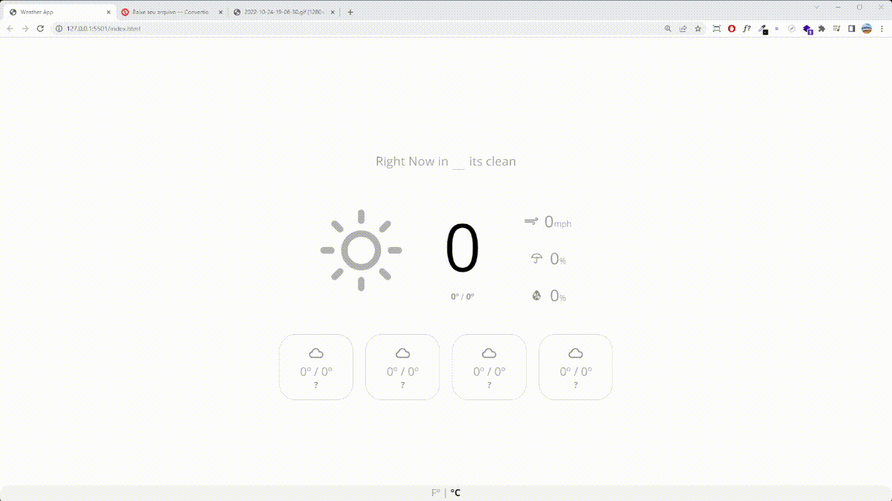

# Weather App

## Projeto e ideias

O projeto foi focado principalmente em desenvolver minhas habilidades
para consumir APIs e usar de forma mais direcionada nos meus projetos,
tendo em vista que foi o meu primeiro projeto realmente usando async 
functions eu acredito que tenha muito o que melhorar principalmente no 
quesito de otimização e segurança. 

## Status

Quase completo

## Design

O design da aplicação foi desenvolvido pelo Matthew Kosloski a alguns 
anos atraz, é minimalista e bem direto, adorei desenvolver.

Caso queira saber mais sobre o design [clica aqui](https://dribbble.com/shots/2138482-Weather-App).